# fxtui-playground

A playground for experimenting with the [FTXUI](https://github.com/ArthurSonzogni/FTXUI) terminal UI library in C++23.

## Structure

```
fxtui-playground/
├── CMakeLists.txt
└── src/
    ├── hello_world/       # each subdirectory is a separate executable
    │   └── main.cpp
    └── my_experiment/
        └── main.cpp
```

Each subdirectory under `src/` is automatically discovered by CMake and built as a separate executable named after the directory. All `.cpp` files within a subdirectory are compiled together into that executable.

## Dependencies

- CMake 3.22+
- A C++23-capable compiler (GCC 13+, Clang 16+, or MSVC 19.35+)
- Git (for FetchContent to download FTXUI)

FTXUI is fetched automatically via CMake FetchContent — no manual installation needed.

## Build

```bash
# Configure
cmake -B build -DCMAKE_BUILD_TYPE=Release

# Build all executables
cmake --build build

# Or build a specific executable (e.g. hello_world)
cmake --build build --target hello_world
```

For a debug build:

```bash
cmake -B build -DCMAKE_BUILD_TYPE=Debug
cmake --build build
```

## Run

After building, executables are placed in the `build/` directory:

```bash
./build/hello_world
```

## Adding a New Experiment

1. Create a new subdirectory under `src/`:
   ```bash
   mkdir src/my_experiment
   ```
2. Add one or more `.cpp` files to it:
   ```bash
   # src/my_experiment/main.cpp
   ```
3. Re-run CMake configure and build:
   ```bash
   cmake -B build
   cmake --build build --target my_experiment
   ```

No changes to `CMakeLists.txt` are needed — new directories are auto-discovered.

## FTXUI Libraries

Each executable is linked against all three FTXUI modules:

| Library | Purpose |
|---|---|
| `ftxui::screen` | Screen buffer and rendering |
| `ftxui::dom` | Declarative element tree (layout, text, borders) |
| `ftxui::component` | Interactive components (menus, inputs, checkboxes) |

## Architecture: Shared Classes (`src/common/`)

Several demos share the same low-level building blocks — 3D vector/matrix math, ASCII-art shading, bouncing-point physics, animation-tick timers, and so on. Rather than duplicating that logic per demo, it lives once under `src/common/` (namespace `common`) and is pulled in via `#include <common/...>`.

Almost everything here follows a **plain struct + free function** idiom (data and behavior kept separate, no inheritance or virtual dispatch) rather than classic OOP classes — it matches the throwaway, no-premature-abstraction nature of a playground repo. The two exceptions are `AnimationTimer` and `ChildProcess`, which own a background thread/OS process and so are real RAII classes with constructors/destructors that manage that lifecycle.

```mermaid
classDiagram
    class Vec3 {
        <<struct>>
        +double x
        +double y
        +double z
        +dot(Vec3) double
        +cross(Vec3) Vec3
        +normalize() Vec3
        +length() double
    }

    class Mat3 {
        <<struct>>
        +double m[3][3]
        +rotation_x(t) Mat3
        +rotation_y(t) Mat3
        +rotation_z(t) Mat3
        +transpose() Mat3
    }

    class Angles {
        <<struct>>
        +double x
        +double y
        +double z
        +wrap_angle(a) double
    }

    class RotationRates {
        <<struct>>
        +double x
        +double y
        +double z
        +init_rotation_rates(rng) RotationRates
        +advance_angles(Angles, rates)
        +build_rotation(Angles) Mat3
    }

    class LightState {
        <<struct>>
        +Vec3 dir
        +Vec3 start_dir
        +double drift_sigma
        +double max_cone_angle
        +advance_light(rng)
    }

    class Lighting {
        <<utility>>
        +shade(normal, light_dir, albedo) double
    }

    class SampleCircle {
        <<struct>>
        +double x
        +double y
        +double r
        +apply_global_contrast(v)
        +directional_fold(local, neighbor) double
    }

    class Glyphs {
        <<utility>>
        +kRamp string
        +ink_fraction(ink, cx, cy, r) double
        +match_char(sample) char
    }

    class AsciiField {
        <<utility>>
        +ascii_from_field(field, cols, rows) char[]
    }

    class Point {
        <<struct>>
        +double x
        +double y
    }

    class Rasterizer2D {
        <<utility>>
        +point_in_triangle(p, a, b, c) bool
        +barycentric(a, b, c, p) Vec3
        +fill_triangle(canvas, p0, p1, p2, color)
    }

    class GridSize {
        <<struct>>
        +int cols
        +int rows
        +compute_grid_size(term) GridSize
    }

    class GridRender {
        <<utility>>
        +render_glyph_cell(bg, fg, glyph, scale) Element
        +render_grid(rows, cols, cell_fn) Element
        +compute_grid_scale(avail_rows, avail_cols, rows, cols) int
        +pixel_to_cell(mx, my, box, scale) pair
    }

    class Scene {
        <<struct>>
        +double cx
        +double cy
        +double vx
        +double vy
        +init_scene(rng, cx0, cy0, speed) Scene
        +update_scene(width, height, radius)
    }

    class SceneRadius {
        <<utility>>
        +compute_scene_radius(cols, rows, fraction) double
    }

    class AnimationTimer {
        <<RAII>>
        -ScreenInteractive screen_
        -milliseconds interval_
        -thread thread_
        +AnimationTimer(screen, interval)
    }

    class MouseInput {
        <<utility>>
        +is_left_click_press(Event) bool
    }

    class ChildProcess {
        <<RAII>>
        -string path_
        -pid_t pid_
        -thread reader_thread_
        +start() bool
        +write_line(line)
    }

    Glyphs ..> SampleCircle : samples
    AsciiField ..> Glyphs : match_char()
    AsciiField ..> SampleCircle
    RotationRates ..> Angles : advances
    RotationRates ..> Mat3 : builds
    LightState *-- Vec3 : dir / start_dir
    Lighting ..> Vec3
    Rasterizer2D *-- Point
    Rasterizer2D ..> Vec3 : barycentric weights
```



The classes fall into a few functional groups:

| Group | Headers | Responsibility |
|---|---|---|
| Vector & rotation math | `vec_math`, `angles`, `rotation_state`, `light_state` | `Vec3`/`Mat3` primitives; per-frame rotation and drifting light-direction state for 3D demos |
| ASCII shading pipeline | `sample_circle`, `glyphs`, `ascii_field`, `lighting` | Turns per-cell brightness samples into shaded, nearest-neighbor-matched ASCII characters |
| Rasterization | `rasterizer2d` | 2D triangle fill / point-in-triangle / barycentric weights, shared by both the canvas-based and ASCII-based renderers |
| Scene & grid sizing | `bouncing_scene`, `scene_radius`, `grid_size` | Bouncing-point physics and the terminal-size → grid-dimension conversions that keep rendering scale and physics radius in sync |
| Terminal grid rendering | `grid_render` | Colored NxM cell-grid layout and mouse-to-cell hit testing, shared by the board-style demos |
| Animation & input | `animation_timer`, `mouse_input` | RAII animation-tick thread; left-click detection helper |
| Process management | `child_process` | RAII subprocess spawn/pipe/teardown, used by chess's UCI/Stockfish integration |

And which demos pull in which pieces:

| Demo | Shared headers used |
|---|---|
| `sphere` | `animation_timer`, `ascii_field`, `bouncing_scene`, `grid_size`, `light_state`, `lighting`, `rotation_state`, `sample_circle`, `scene_radius`, `vec_math` |
| `teapot` | `animation_timer`, `ascii_field`, `bouncing_scene`, `grid_size`, `light_state`, `lighting`, `rasterizer2d`, `rotation_state`, `sample_circle`, `scene_radius`, `vec_math` |
| `rain` | `angles`, `animation_timer`, `ascii_field`, `grid_size`, `lighting`, `rasterizer2d`, `sample_circle`, `scene_radius`, `vec_math` |
| `tetrahedron` | `angles`, `animation_timer`, `bouncing_scene`, `rasterizer2d`, `vec_math` |
| `rotating_triangle` | `animation_timer`, `rasterizer2d` |
| `chess` | `child_process`, `grid_render`, `mouse_input` |
| `sokoban` | `grid_render` |
| `party_parrot`, `matrix`, `game_of_life` | `animation_timer` |
| `scatter_plot`, `histogram` | `mouse_input` |
